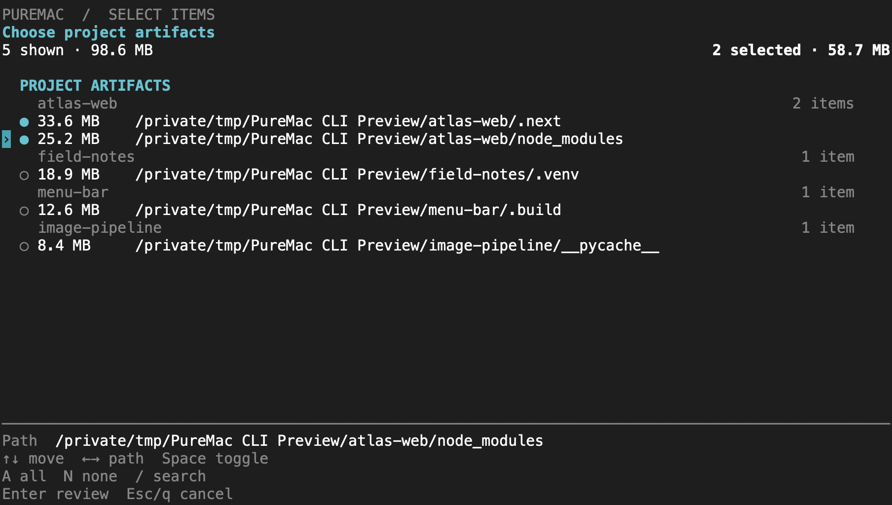
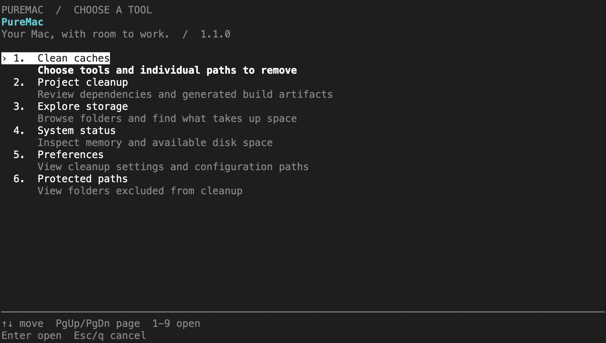

# PureMac CLI

Choose what to clean. See where your space goes.

A native Swift command-line companion to [PureMac](https://github.com/momenbasel/PureMac), with a keyboard-driven workspace, individual file selection, and an interactive storage explorer. Free, open source, and no telemetry.



Captured from the running CLI using sample projects.

## Install

```bash
brew install momenbasel/tap/puremac-cli
puremac
```



Already installed?

```bash
brew update
brew upgrade momenbasel/tap/puremac-cli
```

The release contains a universal binary for Apple Silicon and Intel, signed with Developer ID and submitted to Apple for notarization. Standalone command-line executables cannot carry stapled tickets; the release includes Apple's notarization result.

## Select, review, confirm

Run `puremac` to choose a task, or go straight to a scan:

```bash
puremac clean dev
puremac purge ~/Projects
puremac analyze ~/Projects
```

Cleanup opens a selection screen. Nothing is selected when the interactive review begins. Move through the list, choose individual paths, and check the running size total. Press Return to review the selection, then confirm permanent deletion separately.

| Key | Action |
|---|---|
| Up / Down | Move through the results |
| Space | Toggle the focused item |
| A / N | Select matching results / clear the selection |
| / | Search the results |
| Return | Review the selection |
| Esc / Q | Cancel |

Use Left and Right to scroll a long focused path. The final confirmation prints every selected path in full. Selection is by path, including recent project artifacts that earlier versions only displayed.

Prefer an ordinary scrolling terminal? Use `--plain` for numbered selection and a text review:

```bash
puremac purge ~/Projects --plain
```

The interface adapts to terminal size. `NO_COLOR` disables color. Redirected output and `TERM=dumb` use plain output.

## Explore storage

`puremac analyze` opens a read-only browser sorted by size. Move into a folder with Return or Right, go back with Left or Backspace, and quit with Q. Browsing does not remove anything.

```bash
puremac analyze ~/Projects
puremac analyze ~/Library --plain --depth 2
puremac analyze ~/Projects --json
```

## Commands

| Command | What it does |
|---|---|
| `puremac` | Open the interactive workspace |
| `puremac clean` | Scan developer caches, user junk, AI-tool caches, and Trash |
| `puremac clean dev` | Review package-manager and build-tool caches |
| `puremac clean junk` | Review user logs and generated Xcode files |
| `puremac clean ai` | Review AI-tool caches and logs |
| `puremac clean trash` | Review user and mounted-volume Trash |
| `puremac purge [path]` | Find generated artifacts inside project folders |
| `puremac analyze [path]` | Browse disk usage without modifying files |
| `puremac optimize` | Show factual memory and disk status |
| `puremac ignore add <path>` | Protect a path from cleanup |
| `puremac ignore remove <path>` | Remove that protection |
| `puremac ignore list` | List protected paths |
| `puremac config` | Show settings and their storage locations |

Run `puremac <command> --help` for every option.

## Previews and scripts

`--dry-run` and `--json` never delete files. They do not open the interactive interface, including when combined with `--force`.

```bash
puremac clean dev --dry-run
puremac purge ~/Projects --json
```

`--force` is an explicit unattended cleanup option. It skips selection and confirmation and permanently removes the scanner's default selection. Preview first. For project artifacts, the default selection uses the age threshold, seven days unless configured otherwise; recent artifacts remain excluded.

```bash
puremac purge ~/Projects --older-than 30 --dry-run
puremac purge ~/Projects --older-than 30 --force
```

Without `--force`, a noninteractive cleanup does not delete anything.

## What gets scanned

Developer cleanup covers precise cache locations for Homebrew, npm, Yarn, pnpm, pip, Cargo, Go, CocoaPods, Maven, Gradle, Poetry, uv, Bun, Deno, mise, Flutter/Dart, NuGet, Swift Package Manager, editor caches, and supported Docker/OrbStack cache paths. It does not invoke a broad Docker prune operation.

Project cleanup finds artifacts such as `node_modules`, `.next`, `.nuxt`, `.turbo`, `.svelte-kit`, `target`, `.build`, `DerivedData`, `Pods`, `.venv`, `__pycache__`, and test/tool caches. Source directories are not artifact targets. Review virtual environments and dependencies before removing them; recreating them may require downloads.

The CLI has its own scan engine and safety checks. Its coverage is separate from the Mac app.

## Cleanup boundaries

- Cleanup is permanent. The selection review lists the exact paths before confirmation.
- Critical filesystem roots, credential/configuration roots, and recognized cloud-provider state are protected.
- Symlink checks and ignore-list checks run again before deletion.
- A path containing an ignored descendant is also protected from removal.
- Failures are reported with paths and a nonzero exit status. Scan sizes are estimates, not a guarantee of a matching increase in available disk space.

Protect a project or folder:

```bash
puremac ignore add ~/Projects/important
```

PureMac does not claim to boost RAM or reliably reclaim APFS purgeable space. macOS manages both; `optimize` reports their state without forcing cleanup.

## Build from source

Requires macOS 11 or later and a Swift 5.9+ toolchain.

```bash
cd cli
swift test
swift build -c release
.build/release/puremac
```

See [the local release script](../scripts/release-cli-local.sh) for universal builds, signing, and Apple notarization. Publishing also requires updating the Homebrew formula to the checksum of the released archive.
